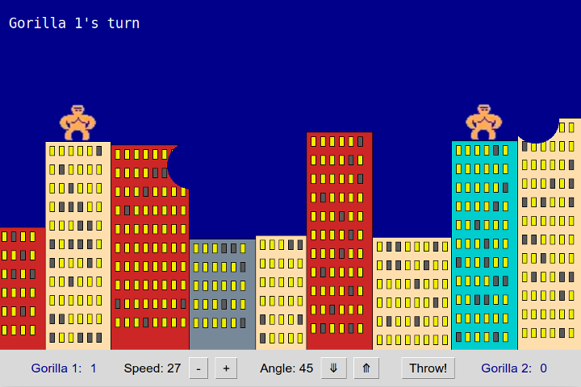

## Gorilla Game

A Python re-implementation of the classic Basic Gorilla game.



## How to Play

Requires Python 3.6 or newer and the `pillow` package for image 
manipulation.  Install pillow using:
```shell
pip3 install pillow
```

Run `monkey_game.py` in a Python 3.6 or newer interpretter:
```shell
python3 monkey_game.py
```

The goal is to throw a banana that hits the other gorilla.

Use the Up & Down arrow keys to change the angle of banana toss; +/- keys to change the speed of banana toss. Press SPACE key to toss a banana. Alternatively, you can press buttons at the bottom of window for these actions.

The game remembers each player's previously selected banana speed and angle.

## Customize the Game

You can easily customize the game by changing the values of some constants.
The files contain comments describing the meaning of the constants.

* Want a bigger canvas or more gravity?  Edit `game_constants.py`.
* Want different building colors and heights? Edit the constants in `building.py`.

## Changes to Starter Code


In `gamelib.GameApp`:

* `create_canvas()` returns the canvas reference instead of setting `self.canvas`.
* add methods `add_element(element)` and `remove_element(element)` so subclasses don't need to directly modify the elements attribute
* `contains(x, y)` returns True if a game element contains point (x,y). This method is needed to detect collision between banana and a game element.
* `start()` sets a reference to the id returned by `after` so animation can be cancelled.
* `stop()` new method to stop animation using the timer id
* `running()` test if the animation loop is running
* `self.timer_id` new attribute to keep track of timer id

In `gamelib.GameCanvasElement` 
* change constructor signature to `__init__(self, canvas, x=0, y=0, **kwargs)`, where `**kwargs` is passed to `init_canvas_object`. This enables passing additional named parameters to Canvas widget constructors. I use `**kwargs` to create Text with alignment.
* method `init_canvas_object(**kwargs)` returns the object id (int) instead of setting it as a side-effect.  This fixes warnings from VSCode about unknown symbol `self.canvas_object_id`.
* make `canvas` a property that returns `self._canvas`

In `gamelib.Sprite`
* add properties `width` and `height` as convenience to get the Sprite's image width and height

Source files

* Split code in `monkeys.py` to separate files for each class.
* MonkeyGame class and the "main" block to start it moved to `monkey_game.py`.
* Move images to `images` subdirectory.
* Add `game_constants.py` for global constants.

## Images and Animation

These classes are provided by the Python `pillow` package.

For a better implementation of PhotoImage use:
```python
from PIL import ImageTk, Image

img1 = ImageTk.PhotoImage(Image.open('myimage.png'))
# or pass image data to constructor:
img2 = ImageTk.PhotoImage(image_data)
```
documentation states that `ImageTk.PhotoImage` is a 
"Tkinter-compatible photo image."
The `ImageTk.PhotoImage` constructor also accepts `file=` and `data=`
parameters to initialize the photo image object.

The `PIL.Image` class has methods rotate or flip an image.
We can use this to create rotated bananas for animation:
```python
image = Image.open("images/banana.png")
# an array to store images
self.images = [image]
# add rotated version of the original image
for angle in range(45,360,45):
     self.images.append( image.rotate(angle) )
```

Then use the `paste(image)` method of ImageTk.PhotoImage to change the image:
```
paste(image)
    Paste Image object into a PhotoImage. `image` must have the same dimensions
    as the original image.
```

While the banana is moving, in the Banana `update` method "paste" 
the next image from the sequence into the banana PhotoImage object.  
This makes the banana appear to spin as it moves.

Documentation for PIL:
* Image <https://pillow.readthedocs.io/en/stable/reference/Image.html>
* ImageTk <https://pillow.readthedocs.io/en/stable/reference/ImageTk.html>

 
## Dialog Box

When a gorilla wins, the game shows a dialog box asking if user wants to play again.
An easy way to do this is using `tkinter.messagebox`:
```python
from tkinter import messagebox

message = "Play\nagain?"
reply = messagebox.askyesno("Game Over", message)  # Returns true or false
if reply:
    print("play another game")
else:
    quit()
```

